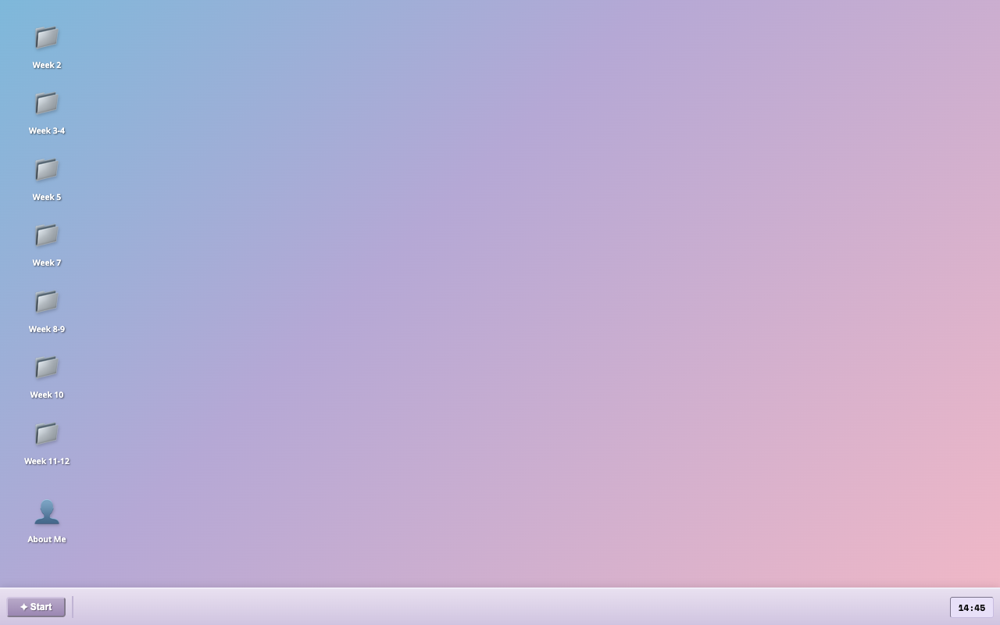
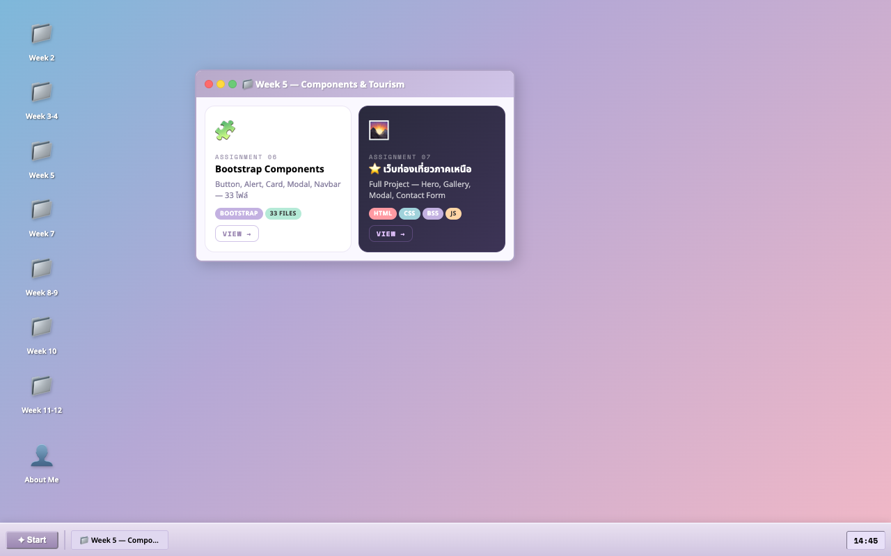
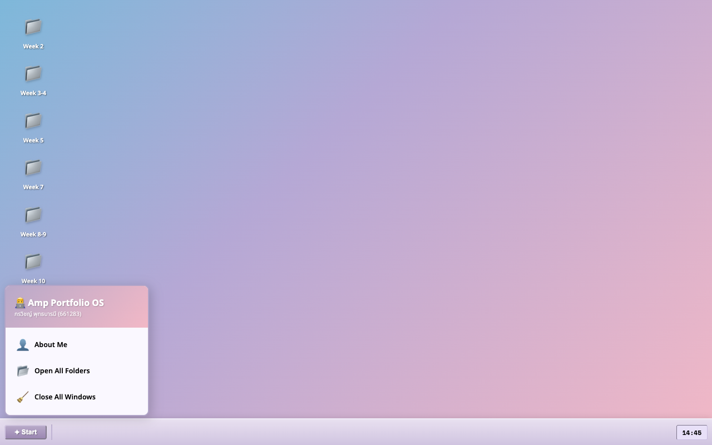

# 💻 AmpOS: Web Development Portfolio

<div align="center">
  
  <br><br>
  <strong>A Unique Desktop Metaphor Portfolio built with Vanilla HTML, CSS, and JS</strong>
  <br><br>
  <code>👨‍💻 กรวิชญ์ พุทธบารมี (661283)</code><br>
  <code>📚 วิชา Web Development — ปีการศึกษา 2026</code>
</div>

---

## 🌟 About The Project
**AmpOS** เป็นโปรเจกต์รวบรวมผลงานวิชา Web Development ที่ไม่ได้เป็นแค่หน้าเว็บธรรมดา แต่ถูกออกแบบให้มีลักษณะเหมือน **ระบบปฏิบัติการ (Desktop OS)** ซึ่งสามารถลากหน้าต่างไปมาได้ (Draggable Windows) มี Start Menu และมี Taskbar จำลองประสบการณ์การใช้งานคอมพิวเตอร์แบบคลาสสิกผสานกับความโมเดิร์นของ Card Layout

### 🛠️ Tech Stack
- **HTML5**: โครงสร้างหน้าเว็บแบบ Semantic
- **CSS3 (Vanilla)**: 
  - ระบบ **Grid** และ **Flexbox** สำหรับการจัดวาง Cards
  - ลูกเล่น **3D Hover Effect** และ Glassmorphism
- **JavaScript (Vanilla)**:
  - ระบบ **Drag & Drop** หน้าต่าง OS
  - ระบบแสดงผล Window ซ้อนทับกัน (Z-index Management)

---

## 📸 Demo & Screenshots (จากระบบจริง!)

### 🖥️ 1. Desktop Interface
หน้าแรกจำลองเป็น Desktop มีไอคอนโฟลเดอร์รวบรวมผลงาน เมื่อดับเบิลคลิกจะเปิดหน้าต่างขึ้นมา
<p align="center">
  
</p>

### 🪟 2. Interactive Windows & Cards
หน้าต่างแสดงผลงานแบบ **Card Grid** ที่ออกแบบมาให้รองรับทุกขนาดหน้าจอ (Responsive) พร้อมปุ่มกดเข้าดูผลงานย่อย
<p align="center">
  
</p>

### ✦ 3. Start Menu & Taskbar
เมนู Start จำลอง พร้อมระบบ Taskbar ที่ซิงค์กับหน้าต่างที่เปิดอยู่ สามารถกดสลับหน้าต่างหรือปิดพร้อมกันได้
<p align="center">
  
</p>

---

## 📂 Project Structure

```text
Amp_Miniproject/
├── portfolio/
│   ├── index.html       # 🚀 หน้าหลัก (OS Engine)
│   ├── style.css        # 🎨 สไตล์ของระบบ OS และการ์ดผลงาน
│   └── images/          # 🖼️ ไอคอนต่างๆ ของระบบ
├── screenshots/         # 📸 รูปภาพ Demo สำหรับ README
├── Assignment-Week2-1/  # 📁 ผลงานสัปดาห์ที่ 2
├── Assignment-Week3-1/  # 📁 ผลงานสัปดาห์ที่ 3
├── Assignment-Week4-1/  # 📁 ผลงานสัปดาห์ที่ 4
├── Assignment-Week5-1/  # 📁 ผลงานสัปดาห์ที่ 5
├── ... (สัปดาห์อื่นๆ 7-12)
└── README.md
```

---

## 🎯 Features

| Feature | Description |
|---------|-------------|
| 🖱️ **Draggable Windows** | หน้าต่างสามารถใช้เมาส์ลาก (Drag) หัวหน้าต่างเพื่อย้ายตำแหน่งได้อย่างอิสระ |
| 📱 **Responsive Grid** | Card ผลงานใช้ `grid-template-columns: repeat(auto-fill, minmax(200px, 1fr))` ยืดหยุ่นตามจอ |
| 🎓 **Educational History** | หน้าต่าง `About Me` มีประวัติการศึกษาพร้อมโลโก้สวยงาม |
| 🎨 **3D Card Hover** | การ์ดมีลูกเล่นยกตัวและเปลี่ยนสีเวลานำเมาส์ไปชี้ |
| ⚡ **No Frameworks** | เขียนด้วย HTML/CSS/JS เพียวๆ ไม่พึ่งพาไลบรารีหนักๆ |

---
*Created with ❤️ by Amp (661283)*
